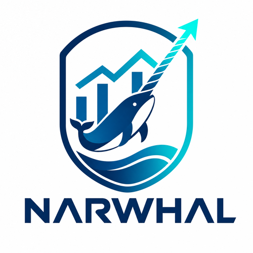

<p align="center">
  <picture>
    <source media="(prefers-color-scheme: dark)" srcset="assets/logo-dark-512.png">
    
  </picture>
</p>

<h1 align="center">Narwhal</h1>

<p align="center"><strong>Local-first SEO &amp; GEO/LLMO scanning — as an agent skill.</strong></p>

<p align="center">
  Audit any page or site for search rankings <em>and</em> AI-answer visibility
  <br>(ChatGPT · Claude · Perplexity · Google AI Overviews) — straight from your coding agent.
</p>

<p align="center">
  <a href="https://github.com/aindong/narwhal/actions/workflows/ci.yml"></a>
  
  
  
  
  
</p>

Narwhal scans a web page or whole site for **SEO** and **GEO/LLMO** (visibility in
AI answer engines) and hands back a **prioritized, fix-first report**. It ships as
an agent skill: use it from Claude Code via
[`SKILL.md`](skills/seo-scan/SKILL.md), or from any agent that reads
[`AGENTS.md`](AGENTS.md) — Codex, Cursor, OpenCode, and friends.

No accounts, no API keys, nothing phones home. It runs on a bare Python install
and gets sharper when optional parsing/rendering libraries are present.

## Why "Narwhal"?

The narwhal is the perfect mascot for a search-and-AI-visibility tool:

- **The tusk is a sensor, not a weapon.** A narwhal's tusk is packed with millions
  of nerve endings that read tiny changes in the water around it. Narwhal the tool
  does the same for a page — it senses the subtle, easy-to-miss signals (meta,
  canonical, schema, passage citability, crawler access) that decide whether you're
  seen.
- **It navigates dark, opaque water.** Narwhals thrive in deep, ice-covered Arctic
  seas using sound, surfacing where nothing else can. Modern search and AI answer
  engines are exactly that kind of murky water — Narwhal helps you navigate it.
- **The "unicorn of the sea."** Rare and unmistakable. That's the whole goal of SEO
  and GEO: to be the distinctive result that ranks and gets *cited* by AI, not one
  of the anonymous many.
- **It dives deep.** Deep audits, not surface-level checks.

And yes, it works as a backronym too:
**N**avigate **A**I **R**ankings, **W**eb **H**ealth **A**nd **L**LM-visibility.

## What it checks

| Area | Highlights |
|---|---|
| **Technical SEO** | title/meta, headings, canonical, robots directives, viewport/mobile, hreflang, images, links, HTTP hygiene, robots.txt, sitemap |
| **Content & E-E-A-T** | thin-content detection, readability, author/date signals, Open Graph / Twitter cards |
| **Structured data** | JSON-LD detection, required/recommended property validation, deprecated rich-result types, JSON-LD generation |
| **GEO / LLMO** | question-based headings, citable passage structure, evidence density, direct-answer intros, `llms.txt`, and **AI-crawler access** (GPTBot, ClaudeBot, PerplexityBot, Google-Extended…) |

## Multi-agent deep audit

`/narwhal audit <site>` (in Claude Code) is more than a script — it's a
**parallel, multi-agent** audit:

1. Runs the deterministic baseline (`audit.py`) for fast, reproducible hard data
   (homepage + site crawl + sitemap, per-area subscores, broken links, duplicates).
2. **Fans out ~10 specialist subagents in parallel** — technical, content, schema,
   geo, performance, links, duplication, sitemap, sxo (+ local when relevant). Each
   runs the deterministic scripts as its **tools**, then adds expert reasoning and
   exact fixes for its domain.
3. **Synthesizes** one report: an SEO Health Score, executive summary, prioritized
   action plan (Critical → Low), and quick wins.

The scripts do the **measurement** (fast, zero-dep, reproducible); the agents do the
**reasoning** (business context, what heuristics miss, concrete fixes). Specialist
definitions live in [`agents/`](agents/). The other actions (`scan`, `crawl`,
`sitemap`, `llms`, `schema`) run directly for quick, deterministic output.

## Quick start

```bash
# 1. (optional) install extras for better parsing + JS rendering
pip install -r skills/seo-scan/requirements.txt

# 2. audit a single page
python skills/seo-scan/scripts/scan.py https://example.com/page

# 3. audit a whole site (polite crawler: honors robots.txt, parallel, rate-limited)
python skills/seo-scan/scripts/crawl_site.py https://example.com --max-pages 25 --concurrency 4

# 4. generate valid schema.org JSON-LD
python skills/seo-scan/scripts/generate_schema.py Article \
  --field headline="How GEO works" --field author="Jane Doe"
```

Every report includes a 0–100 health score and findings grouped by severity, each
with what was observed and a concrete fix.

### Useful flags (`scan.py`)
- `--render` — render JavaScript via Playwright (for SPAs). Needs
  `pip install playwright` then `python -m playwright install chromium`. If the
  browser isn't installed you get a clear one-line fix, not a stack trace; a
  render that can't run reports an honest error rather than silently falling back
  to raw HTML.
- `--format json|html|pdf [-o file]` — machine-readable JSON, a **self-contained,
  styled HTML** report (score gauge, severity-coloured finding cards — see the
  [sample](docs/samples/sample-report.html)), or **PDF** (needs WeasyPrint; falls
  back to HTML if it isn't installed). `html`/`pdf` also work on `audit.py` for a
  shareable, stakeholder-ready deliverable.
- `--only technical,content,schema,geo` — run a subset of auditors.
- `--fail-under N` — exit non-zero if the score is below `N`. Use it as a **CI
  quality gate** (also on `crawl_site.py`, where it checks the average score):
  ```bash
  python skills/seo-scan/scripts/scan.py https://example.com --fail-under 80
  ```
- `--allow-private` — permit localhost/staging targets (off by default; see below).

### Track health over time (regression tracking, no database)

Narwhal stays stateless: instead of a database, save a scan as JSON and diff two
runs. Human-readable, git-friendly, and the agent can read the diff directly.

```bash
python skills/seo-scan/scripts/scan.py https://example.com --format json -o before.json
# ...after changes...
python skills/seo-scan/scripts/scan.py https://example.com --format json -o after.json
python skills/seo-scan/scripts/diff_scan.py before.json after.json
```

The diff shows the **score delta** and which findings are **new**, **resolved**,
**worsened**, or **improved** (dynamic titles like `Thin content (210 words)` are
matched across runs). Add `--fail-on-regression` as a **CI gate** — it exits
non-zero if the score dropped or a new critical/high finding appeared. Commit the
JSON snapshots alongside your repo to keep a lightweight history. Works on `audit`
JSON too.

### Real Core Web Vitals (opt-in)

Everything above is local and honest about what it can measure — it will **never
fabricate** field metrics. When you want *real* Core Web Vitals (what actual Chrome
users experience), Narwhal can query Google's **Chrome UX Report (CrUX) API**. This
is the one feature that calls an external service, so it's **opt-in** and needs a
free [CrUX API key](https://developer.chrome.com/docs/crux/api):

```bash
narwhal vitals https://example.com/page --crux-key YOUR_KEY
# or set it once:
export CRUX_API_KEY=YOUR_KEY
narwhal vitals https://example.com --origin --form-factor phone
```

You get **LCP, INP, CLS** (the Core Web Vitals; INP replaced FID in 2024) at the
75th percentile, each rated good / needs-improvement / poor, plus a pass/fail
verdict. CrUX only has data for pages/origins with enough real traffic — low-traffic
URLs return "no data" (try `--origin`).

## Install

### Claude Code — plugin (recommended, one command)

Narwhal ships as a Claude Code plugin. Add the marketplace and install it:

```text
/plugin marketplace add aindong/narwhal
/plugin install narwhal@narwhal
```

That's it — the skill and its scripts load automatically. Then use the slash
command:

```text
/narwhal audit example.com      # full single-page audit
/narwhal crawl example.com      # site-wide crawl (links + duplicates)
/narwhal sitemap example.com    # validate the XML sitemap(s)
/narwhal llms example.com       # generate a starter llms.txt
```

`/narwhal <action> <site>` takes actions `scan`/`audit`, `crawl`, `sitemap`,
`llms`, `schema`. You can also just ask Claude naturally:

> Run an SEO and GEO audit on https://example.com

To update later, run `/plugin marketplace update narwhal`; to remove, `/plugin
uninstall narwhal@narwhal`. (The first `narwhal` is the marketplace, the second is
the plugin.)

### Run instantly with `uvx` (no install, no PyPI)

If you have [`uv`](https://docs.astral.sh/uv/), run Narwhal straight from GitHub in
a throwaway environment — always the latest, nothing left behind:

```bash
uvx --from git+https://github.com/aindong/narwhal narwhal scan https://example.com
uvx --from git+https://github.com/aindong/narwhal narwhal crawl https://example.com --max-pages 25
uvx --from git+https://github.com/aindong/narwhal narwhal schema Article --field headline="…"
uvx --from git+https://github.com/aindong/narwhal narwhal sitemap https://example.com
uvx --from git+https://github.com/aindong/narwhal narwhal llms https://example.com
```

The unified `narwhal` command has subcommands `audit`, `scan`, `crawl`, `schema`,
`sitemap`, `llms`, and `diff` (run any with `-h`). Prefer a stable command? Alias it:

```bash
alias narwhal='uvx --from git+https://github.com/aindong/narwhal narwhal'
narwhal scan https://example.com --fail-under 80
```

### Claude Code — manual (no plugin system)

Copy or symlink `skills/seo-scan/` into `~/.claude/skills/` (user-wide) or
`.claude/skills/` (per project), or run the installer:

```bash
bash install.sh        # macOS / Linux
```
```powershell
./install.ps1          # Windows
```

### Codex / Cursor / OpenCode / other agents

Point the agent at this repo — the root [`AGENTS.md`](AGENTS.md) documents the same
tools in the format those agents read. Then ask for an audit.

### MCP server (any MCP client)

Narwhal can also run as a [Model Context Protocol](https://modelcontextprotocol.io)
server, exposing every auditor as a native tool (`scan_page`, `crawl_site`,
`audit_site`, `validate_sitemap`, `generate_llms`, `generate_schema`,
`diff_reports`) over stdio. It's a thin, typed adapter over the same scripts — no
new analysis, so results match the CLI exactly.

```bash
pip install "narwhal-seo[mcp]"   # or: pip install "mcp>=1.12"
narwhal mcp                       # runs the stdio server
```

Register it with a client — e.g. Claude Desktop's `claude_desktop_config.json`:

```json
{
  "mcpServers": {
    "narwhal": { "command": "narwhal", "args": ["mcp"] }
  }
}
```

MCP is optional; the core toolkit stays zero-dependency.

## Design principles

- **Local-only by default.** No external services are called. Optional API
  integrations (PageSpeed/CrUX, SERP data) are intentionally *not* on the default
  path — the scan is honest about what it can and can't measure locally.
- **Graceful degradation.** Works with only the Python standard library; uses
  `requests`, `beautifulsoup4`/`lxml`, `trafilatura`, and `playwright`
  automatically when installed.
- **SSRF-safe.** URLs that resolve to private, loopback, or link-local addresses
  are blocked unless you explicitly pass `--allow-private`.
- **Fix-first output.** Reports lead with the highest-severity, highest-leverage
  changes — not a data dump.

## Reference guides

Deep-dive reasoning behind each check lives in
[`skills/seo-scan/references/`](skills/seo-scan/references/):
`technical-seo.md`, `content-eeat.md`, `schema.md`, `geo-llmo.md`.

## Configuration (optional)

Narwhal needs no config, but you can drop a **`narwhal.toml`** at your project root
to tune scoring weights, check thresholds, CLI defaults, and which findings to
ignore. It's auto-discovered; precedence is **CLI flag > `narwhal.toml` > default**.

```toml
[defaults]
fail_under = 85            # CI gate: fail below 85

[thresholds]
thin_content = 250         # our pages are intentionally concise

[ignore]
categories = ["geo"]       # hide all GEO findings
titles     = ["Open Graph"]# hide the social-preview nag
```

Full reference: **[docs/CONFIG.md](docs/CONFIG.md)** · commented template:
**[narwhal.example.toml](narwhal.example.toml)**. Use `--config PATH` or
`--no-config` to override discovery.

## Roadmap & docs

- **[docs/STATUS.md](docs/STATUS.md)** — current state & handoff snapshot.
- **[docs/ROADMAP.md](docs/ROADMAP.md)** — where Narwhal is headed (priorities,
  milestones), linked to tracking issues.
- **[CHANGELOG.md](CHANGELOG.md)** — release history.
- **[docs/](docs/README.md)** — documentation index.
- **[Issues](https://github.com/aindong/narwhal/issues)** — detailed tasks; see also
  [CONTRIBUTING.md](CONTRIBUTING.md).

## Requirements

Python 3.8+. Optional extras in
[`skills/seo-scan/requirements.txt`](skills/seo-scan/requirements.txt).

## License

MIT — see [LICENSE](LICENSE).
